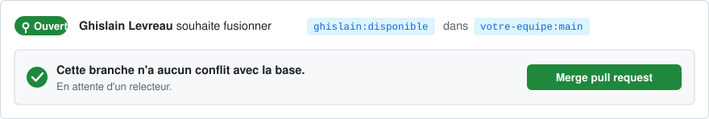

<picture>
  <source media="(prefers-color-scheme: dark)" srcset="profil-github/banner-merge-dark.svg">
  
</picture>

&nbsp;

Je cadre des besoins, je coordonne des équipes et je livre. Polytech Marseille, cycle ingénieur, puis mastère en management de la transformation digitale. Fondateur de [GHIS!](https://ghis.fr), studio digital en PACA.

&nbsp;

<picture>
  <source media="(prefers-color-scheme: dark)" srcset="profil-github/diff-dark-2.svg">
  
</picture>

### Ce que je fais

**Pilotage.** Cadrage fonctionnel, spécifications, planification, suivi agile, recette, mise en production.

**Web.** Conception et développement, du site vitrine au SaaS multi-clients. React, Next.js, Node.

**IA et data.** Agents conversationnels, automatisation de processus, analyse de données.

### Ce que j'ai livré

**[monemplacement.fr](https://www.monemplacement.fr)** · produit GHIS. Un score d'opportunité commerciale par quartier, construit sur les registres publics français : Sirene, Insee, Bodacc, DVF. 807 quartiers analysés, environ 5 000 pages générées, étude d'implantation vendue en ligne. Conception produit, pipeline de données, développement, mise en production. Next.js, Python, Stripe.

**HiveStock** · application mobile de gestion de garde-manger. Conception produit et développement, en cours. React Native, Expo.

**Plateforme SaaS multi-clients et agent IA téléphonique** · missions d'ingénieur et de chef de projet, MOA et MOE, pour une SAS marseillaise. Next.js, AWS, OpenAI, Twilio.

Ce travail tourne en production chez des clients ou en interne. Les dépôts ne sont pas publics, les liens mènent au résultat.

### Stack

React · Next.js · Node · TypeScript · Tailwind · PHP · Angular

Python · SQL · MongoDB · Power BI

AWS · Docker · Vercel · GitHub Actions

Jira · Scrum · Figma · Claude Code

### Contact

[LinkedIn](https://www.linkedin.com/in/levreaughislain/) · [ghis.fr](https://ghis.fr) · [levreaughislain@gmail.com](mailto:levreaughislain@gmail.com)
